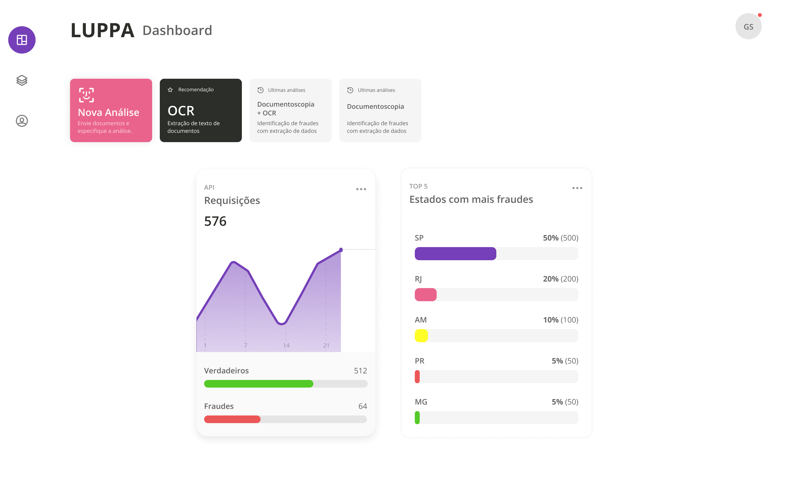

# Luppa Full-Stack Challenge

O objetivo deste desafio é avaliar seu domínio em desenvolvimento web e onde suas habilidades tem maior destaque.

Este é um teste para todos os níveis, portanto, não esperamos que você conclua 100% ou utilize todos os conceitos citados. Nosso objetivo é te conhecer melhor e saber onde seu conhecimento sobressai e a forma como você desenvolve.

Esperamos um front-end estruturado como um SPA utilizando ReactJS e um back-end em NodeJS, sinta-se a vontade para utilizar todas as ferramentas de sua escolha. Além disso, gostaríamos que registrasse todo o processo de desenvolvimento.

Queremos ver a legibilidade e seu design de código, as boas práticas de desenvolvimento, Design Patterns TypeScript utilizados e todo o seu processo de trabalho. Você está livre para criar, commitar e organizar seu projeto da maneira que considerar ideal.

## O Desafio

Sabendo que nosso sistema é utilizado para detectar possíveis fraudes em documentos, seu desafio será desenvolver uma tela de dashboard para nossos usuários terem uma melhor visualização de volumetria de uso e de fraudes detectadas pela API, e extrair informações dessas métricas.
Devem ser apresentados dois gráficos:

1. Quantidade total de requisições recebidas, separadas em fraudes e verdadeiras;

2. Top 5 estados com maior número de fraudes, incluindo sua porcentagem em relação ao total de fraudes existentes. Ex: De 150 fraudes, 50% são de SP, 25% de PR, 5% de RJ...

Os dados dos gráficos devem ser fornecidos pelo back-end. Exigimos apenas que exista uma rota, os dados utilizados para plotar os gráficos podem ser **Mocks**.

Crie um projeto para apresentar a tela e componentes com o estilo que desejar.

A forma de estruturação da aplicação é livre e você pode priorizar partes que demonstrem melhor o seu conhecimento. Consideramos diferenciais testes automatizados, documentação de projeto e uso de docker.

Documente tudo que julgar necessário, inclusive as motivações de diferentes bibliotecas e Frameworks utilizados.

## O que recomendamos

- Utilize ReactJS e NodeJS;
- Dê prioridade em resolver problemas com funções do próprios do TypeScript;

## O que vamos avaliar

- Boas práticas de programação;
- Domínio de Frameworks e TypeScript;
- Componentização e organização do seu projeto;
- Documentação do projeto e justificativas de escolhas técnicas;
- O processo de desenvolvimento com Git.

## Apresentação do desafio

- Crie um repositório para o projeto em sua conta pessoal no GitHub;
- Crie um README.md com as instruções para a execução do projeto;
- Nos envie o link do repositório para o email [luppa@executive.com.br](mailto://luppa@executive.com.br).
